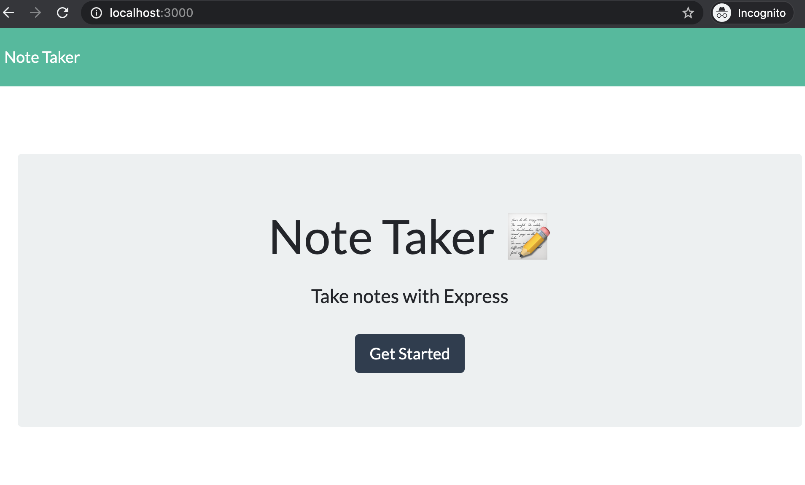
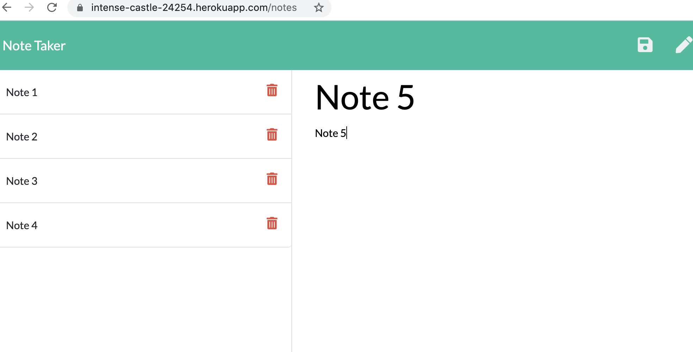

# 11-note-taker


The goal was to create an application that can be used to write, save, and delete notes. This app uses an express backend and saves and retrieves note data from a JSON file. The process involved building the application backend and connecting it with the frontend. For users that need to keep track of a lot of information, it's easy to forget or be unable to recall something important. Being able to take persistent notes allows users to have written information available when needed.

Explore the app here: https://note-taker-zs.herokuapp.com/

## User Story

```
AS A user, I want to be able to write and save notes
I WANT to be able to delete notes I've written before
SO THAT I can organize my thoughts and keep track of tasks I need to complete
```

# Table of Contents

- [Installation](#Installation)
- [Usage](#Usage)
- [Contributing](#Contributing)
- [License](#License)
- [Questions](#Questions)

## Installation

```
ii. Clone the repo into your local machine using gitbash/terminal to pull the project and data.
iii. Run the command-lines below to run the app functionality. You can also access the files and assets via Visual Studio to view the code.
iv. Explore the app: add, save, view and/or delete notes.
v. App deployed on Heroku.
```

## Usage

```
Key Components Used:
Express - Heroku - JavaScript - db.json - fs module - HTML Routes - API Routes - GET/POST requests - listener
```

- Below are screenshots of the deployed application:
  

- Screenshot of deployed app in Heroku:
  

Ensured the following app functionality:

- Application should allow users to create and save notes.
- Application should allow users to view previously saved notes.
- Application should allow users to delete previously saved notes.

## Contributing

No contribution required

## License

[MIT](https://choosealicense.com/licenses/mit/)

## Questions

Have questions? Contact me at:

##### Email: zsaid735@gmail.com

##### Github: **zaydsaid1** [zaydsaid1](https://github.com/zaydsaid1)
